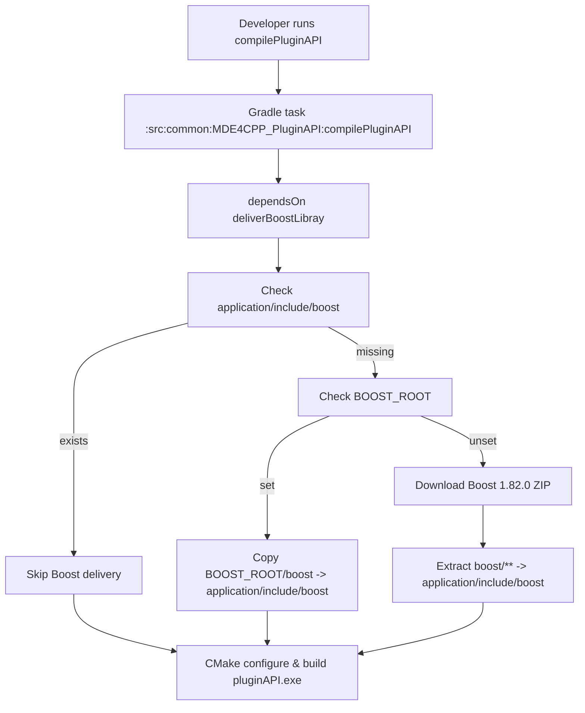
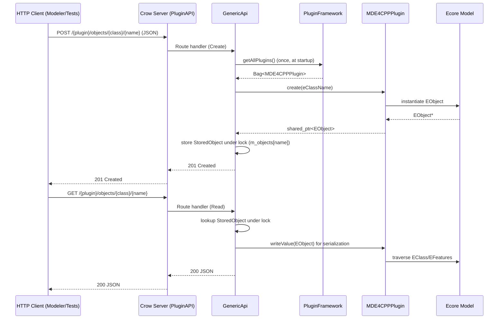
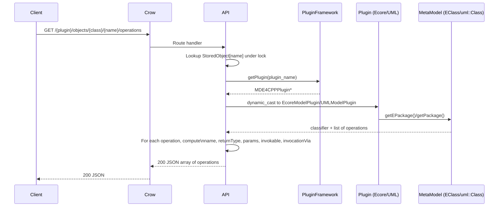

## PluginAPI Evolution & Research Report

This document has two major parts:

- **Part 1**: How we got the **original PluginAPI** (from `other-commit`) to _build and run_ reliably, without changing its intended behaviour.
- **Part 2**: What **new capabilities** we added to PluginAPI later (tree, operations, richer reflection, integration with the modeler), and how we fixed and hardened those.

The goal is to serve as a **technical archaeology report**: it explains _what_ changed, _why_ it likely changed, and _how_ the current system behaves, with code-level details and diagrams.

### How to Read This Document (Layman → Deep Dive)

- **If you are non-technical or new to this codebase**, focus on the short “plain-language” paragraphs at the start of each major subsection (they explain the ideas without assuming C++/Gradle knowledge).
- **If you are an engineer who just wants the gist**, read the bullet lists and the small diagrams first; they show inputs/outputs and responsibilities.
- **If you need full technical detail**, read the code snippets and the text around them; those sections map explanations directly onto specific functions, classes, and build steps.

You can think of each section as going through three layers:

1. **Layman summary** – what problem we had in real-world terms.
2. **High-level design** – which components we changed and how they interact.
3. **Code-level detail** – which files, functions, and lines implement the behaviour.

---

## Part 1 – Making the Original PluginAPI Build and Run

### 1.1 Original PluginAPI Shape (in `other-commit`)

**Plain-language view.**  
Imagine PluginAPI as a very small web server that keeps a dictionary of “model objects” in memory. Each object has a name (like `"book1"`), and the server lets you:

- create an object under some plugin,
- ask for its current state as JSON,
- update it,
- or delete it again.

At this stage, the server is **simple but fragile**: it doesn’t protect itself against multiple users calling it at once, and it assumes the build environment (Boost, Crow) is correctly installed by the user.

**More technical view.**  
In the `other-commit` snapshot, the PluginAPI is a **thin HTTP layer** around the `PluginFramework` and the Ecore runtime. It exposes a basic CRUD API over HTTP using **Crow**:

- **Data model**
  - A single in-memory map of live objects:
    - `std::map<std::string, std::shared_ptr<ecore::EObject>> m_objects;`
  - Objects are indexed **only by instance name** (no explicit plugin or class metadata).
- **Endpoints** (all configured in the `GenericApi` constructor):
  - `POST /{plugin}/objects/{class}/{name}` – create one object.
  - `GET /{plugin}/objects/{class}/{name}` – read one object.
  - `PUT /{plugin}/objects/{class}/{name}` – replace one object.
  - `DELETE /{plugin}/objects/{class}/{name}` – delete one object.
  - `POST /{plugin}/objects` – bulk create objects from a JSON array.
  - `GET /{plugin}/objects/` – list all objects in the in-memory `m_objects` map.
  - `GET /plugins` – list plugin names discovered by `PluginFramework`.
  - `/`, `/{path}` – serve mustache templates (Swagger-ish UI).

Core header in `other-commit`:

```cpp
// other-commit/src/common/MDE4CPP_PluginAPI/src/MDE4CPP_PluginAPI.hpp
#include "util/crow_all.h"
#include "abstractDataTypes/Any.hpp"
#include "abstractDataTypes/Bag.hpp"
#include "ecore/EObject.hpp"
#include "ecore/EClass.hpp"
#include "ecore/EStructuralFeature.hpp"
#include "ecore/EReference.hpp"
#include "ecore/EcoreContainerAny.hpp"
#include "pluginFramework/PluginFramework.hpp"
#include "ecore/ecorePackage.hpp"

using namespace ecore;

class GenericApi {
public:
    static std::shared_ptr<GenericApi> eInstance(
        std::shared_ptr<PluginFramework>& pluginFramework);

    crow::json::wvalue writeValue(
        const std::shared_ptr<ecore::EObject>& object,
        const std::shared_ptr<MDE4CPPPlugin>& plugin);

    std::shared_ptr<ecore::EObject> readValue(
        const crow::json::rvalue& content,
        const std::string& eClass,
        const std::shared_ptr<MDE4CPPPlugin>& plugin);

private:
    explicit GenericApi(std::shared_ptr<PluginFramework>& pluginFramework);

    template<typename T>
    crow::json::wvalue writeFeature(
        const std::shared_ptr<EObject>& object,
        const std::shared_ptr<EStructuralFeature>& feature);

    template<typename T>
    T convert_to(const crow::json::rvalue& value);

    template<typename T>
    std::shared_ptr<Any> readFeature(
        const std::shared_ptr<EObject>& object,
        const std::shared_ptr<EStructuralFeature>& feature,
        const crow::json::rvalue& content);

    std::shared_ptr<MDE4CPPPlugin> getPlugin(std::string name);
    void mapPlugins();

    std::shared_ptr<PluginFramework> m_pluginFramework;
    std::map<std::string, std::shared_ptr<ecore::EObject>> m_objects{};
    std::map<std::string, std::shared_ptr<MDE4CPPPlugin>> m_plugins{};
};
```

Constructor and key CRUD endpoints (simplified):

```cpp
// other-commit/src/common/MDE4CPP_PluginAPI/src/MDE4CPP_PluginAPI.cpp
GenericApi::GenericApi(std::shared_ptr<PluginFramework>& pluginFramework) {
    m_pluginFramework = pluginFramework;
    mapPlugins(); // initial map of all plugins

    crow::SimpleApp app;

    // Create
    CROW_ROUTE(app, "/<string>/objects/<string>/<string>")
        .methods(crow::HTTPMethod::Post)
        ([this](const crow::request& request,
                const std::string& plugin_name,
                const std::string& className,
                const std::string& objectName) {
            if (m_objects.find(objectName) != m_objects.end()) {
                return crow::response(400, "Object already exists!");
            }

            const auto& plugin = getPlugin(plugin_name);
            if (!plugin) {
                return crow::response(404, "Plugin not found!");
            }

            auto object =
                readValue(crow::json::load(request.body), className, plugin);
            m_objects[objectName] = object;
            return crow::response(201);
        });

    // Read
    CROW_ROUTE(app, "/<string>/objects/<string>/<string>")
        .methods(crow::HTTPMethod::Get)
        ([this](const std::string& plugin_name,
                const std::string& className,
                const std::string& objectName) {
            if (m_objects.find(objectName) == m_objects.end()) {
                return crow::response(404);
            }

            const auto& plugin = getPlugin(plugin_name);
            if (!plugin) {
                return crow::response(404, "Plugin not found!");
            }

            auto result = writeValue(m_objects[objectName], plugin);
            return crow::response(200, result);
        });

    // ... Update, Delete, bulk POST /{plugin}/objects, list GET /{plugin}/objects/

    app.bindaddr("127.0.0.1").port(8080).multithreaded().run();
}
```

**Key issues in this original design:**

- **No thread safety**:
  - `m_objects` is a plain `std::map` accessed from multiple Crow threads (`multithreaded().run()`).
  - Create/read/update/delete can all run concurrently with no `mutex`.
- **No explicit plugin/type metadata per object**:
  - `m_objects` only knows the **name** of each object.
  - Requests specify `plugin_name` and `className` in the URL, but nothing guarantees that the object with that name was created under that plugin/class.
- **Fragile JSON handling**:
  - `crow::json::load(request.body)` is called directly; invalid JSON can throw and take down the handler.
  - No fallback between simple and fully-qualified class names (`Class` vs `plugin::Class`).
- **Fragile serialization/deserialization**:
  - `writeValue` / `readValue` directly traverse Ecore structures with limited error handling.
  - Exceptions can bubble up and crash the server.
- **Build‑time dependency gap (Boost)**:
  - Crow’s `crow_all.h` includes a large portion of **Boost**.
  - The build scripts in `other-commit` referenced a `deliverBoostLibray` task, but that task did **not exist**, causing compile failures when building PluginAPI.

The first wave of fixes focused on:

1. **Build‑time stability** – ensuring Boost headers exist so Crow/PluginAPI can compile.
2. **Runtime stability** – making the existing CRUD endpoints safe under concurrency and bad input, without changing their conceptual behaviour.

---

### 1.2 Build-Time Fix – Delivering Boost for Crow/PluginAPI

**Plain-language summary.**  
To speak HTTP, our C++ server uses a library called **Crow**, and Crow in turn depends heavily on another library called **Boost**. In the first version of the project:

- The build scripts _assumed_ Boost was present somewhere on the machine.
- Nothing in the repo actually **fetched or configured Boost**.
- When you tried to build PluginAPI from a clean machine, compilation failed with “cannot find Boost header” errors.

So the first big fix was: **teach the build to fetch or locate Boost automatically** before trying to compile PluginAPI. After this change, a fresh clone of the repo can build the C++ HTTP server without manual Boost setup.

#### 1.2.1 Situation in `other-commit`

In `other-commit`, the PluginAPI’s Gradle script already expected a task called `deliverBoostLibray`:

```gradle
// other-commit/src/common/MDE4CPP_PluginAPI/build.gradle
task compilePluginAPI(type: tui.sse.mde4cpp.MDE4CPPCompile) {
    group "pluginAPI"
    description "compile pluginAPI"

    dependsOn getRootProject().getTasksByName('compilePluginFramework', true)
    dependsOn getRootProject().getTasksByName('deliverPluginFrameworkInterface', true)
    dependsOn getRootProject().getTasksByName('deliverBoostLibray', true)
    dependsOn getRootProject().getTasksByName('buildTypes', true)
    dependsOn getRootProject().getTasksByName('buildEcore', true)
    ...
}
```

However:

- The **root** `build.gradle` in `other-commit` had **no implementation** of `deliverBoostLibray`.
- `crow_all.h` (in `src/util`) included many Boost headers (e.g. `boost/algorithm/string/predicate.hpp`, `boost/asio.hpp`).
- As a result:
  - `compilePluginAPI` ran without ever delivering Boost headers to the include path.
  - CMake configured with `INCLUDE_DIRECTORIES(../ ${MDE4CPP_HOME}/application/include)` only.
  - Compiling PluginAPI failed with errors like:
    - `fatal error: boost/algorithm/string/predicate.hpp: No such file or directory`.

**Net effect:** the original PluginAPI could not be compiled **from scratch** without a lot of manual Boost setup.

#### 1.2.2 Implementing `deliverBoostLibray` in `MDE4CPP`

In `MDE4CPP/build.gradle`, we implemented the missing task with the **same name** (`deliverBoostLibray`, typo preserved) so that all the existing `dependsOn` sites in subprojects started working immediately:

```gradle
// MDE4CPP/build.gradle
/**
 * Deliver Boost headers for PluginAPI (Crow dependency).
 * 1. If application/include/boost already has headers, skip.
 * 2. If BOOST_ROOT is set, copy from there to application/include/boost.
 * 3. Else download Boost 1.82.0 and extract the boost/ folder to application/include/boost.
 */
task deliverBoostLibray {
    group 'pluginAPI'
    description 'Deliver Boost headers to application/include/boost for Crow/PluginAPI'

    def boostIncludeDir = file("${rootDir}/application/include/boost")
    def requiredHeader = file("${rootDir}/application/include/boost/algorithm/string/predicate.hpp")
    def requiredIpp = file("${rootDir}/application/include/boost/asio/execution/impl/receiver_invocation_error.ipp")
    def toolsDir = file("${rootDir}/application/tools")
    def boostZip = file("${toolsDir}/boost_1_82_0.zip")
    def boostUrl = "https://archives.boost.io/release/1.82.0/source/boost_1_82_0.zip"

    outputs.dir(boostIncludeDir)
    outputs.upToDateWhen { requiredHeader.exists() && requiredIpp.exists() }

    doFirst {
        if (requiredHeader.exists() && requiredIpp.exists()) {
            return
        }

        // 1) Prefer user-provided Boost via BOOST_ROOT
        def boostRoot = System.getenv('BOOST_ROOT')
        if (boostRoot != null && !boostRoot.isEmpty()) {
            def boostSrc = file("${boostRoot}/boost")
            if (!boostSrc.exists() || !boostSrc.isDirectory()) {
                throw new GradleException("BOOST_ROOT (${boostRoot}) must contain a 'boost' subdirectory.")
            }
            copy {
                from(boostSrc)
                into(boostIncludeDir)
                include('**/*.hpp', '**/*.h', '**/*.ipp')
            }
            println "Delivered Boost headers from ${boostRoot} to application/include/boost"
            return
        }

        // 2) Fallback: download Boost 1.82.0 and extract headers
        toolsDir.mkdirs()
        if (!boostZip.exists()) {
            println "Downloading Boost 1.82.0 (required for PluginAPI)..."
            boostZip.withOutputStream { os ->
                new URL(boostUrl).withInputStream { is -> os << is }
            }
        }
        println "Extracting Boost headers to application/include/boost..."
        copy {
            from(zipTree(boostZip))
            into(file("${rootDir}/application/include"))
            include("boost_1_82_0/boost/**/*.hpp",
                    "boost_1_82_0/boost/**/*.h",
                    "boost_1_82_0/boost/**/*.ipp")
            eachFile { fcd -> fcd.path = fcd.path.replaceFirst("boost_1_82_0/", "") }
            includeEmptyDirs = false
        }
        println "Boost headers delivered to application/include/boost"
    }
}
```

This task:

- Ensures `application/include/boost/**` contains a usable subset of Boost.
- Allows both:
  - **System‑installed Boost** via `BOOST_ROOT`, and
  - **Self-contained Boost** by downloading the official 1.82.0 archive.

Because `compilePluginAPI` already had:

```gradle
dependsOn getRootProject().getTasksByName('deliverBoostLibray', true)
```

the PluginAPI compile now **automatically** runs the Boost delivery step as needed.

#### 1.2.3 CMake Support for `BOOST_ROOT`

We also updated the PluginAPI CMake configuration so that developers who have Boost installed system-wide can simply set `BOOST_ROOT` and bypass the Gradle download:

```cmake
// MDE4CPP/src/common/MDE4CPP_PluginAPI/src/CMakeLists.txt

SET(SOURCE_FILES
    MDE4CPP_PluginAPI.cpp
    MDE4CPP_PluginAPI_Main.cpp
)

# Crow (in util/crow_all.h) requires Boost headers. Either:
# - BOOST_ROOT is set: add it so that #include <boost/...> finds $BOOST_ROOT/boost/...
# - Else: deliverBoostLibray copies to application/include/boost, so application/include is enough
INCLUDE_DIRECTORIES(
    ../
    ${MDE4CPP_HOME}/application/include
)
IF(DEFINED ENV{BOOST_ROOT})
    INCLUDE_DIRECTORIES($ENV{BOOST_ROOT})
ENDIF()
```

**Result:** PluginAPI can now be built **reliably** in multiple setups:

- With a preinstalled Boost (via `BOOST_ROOT`).
- Without any Boost, using the Gradle task to download and stage headers locally.

#### 1.2.4 Build Flow Diagram



---

### 1.3 Runtime Fixes for the Original CRUD API

**Plain-language summary.**  
Once the server could compile, the next set of problems were **“it crashes sometimes when you click around”** or **“two requests at the same time corrupt data”**:

- The old code was like one shared spreadsheet that several people could edit at once with **no locking**.
- If two HTTP requests tried to create or delete the same object at the same time, or if a request sent malformed JSON, the process could throw exceptions and die.

To fix this, we:

- Wrapped access to the in-memory object map in a **mutex** (lock) so only one thread can mutate it at a time.
- Stored extra metadata for each object (which plugin and class it belongs to).
- Added many small guards and `try/catch` blocks so bad input turns into **HTTP errors** instead of **process crashes**.

The important point: these changes **did not change the API surface** (same URLs, same basic behaviour) – they simply made the original PluginAPI **safe and predictable**.

#### 1.3.1 Adding `StoredObject` and a Mutex Around `m_objects`

To eliminate data races and enable better introspection, we refactored the in‑memory object map in the new PluginAPI:

```cpp
// MDE4CPP/src/common/MDE4CPP_PluginAPI/src/MDE4CPP_PluginAPI.hpp

struct StoredObject {
    std::string pluginName;
    std::string className;
    std::shared_ptr<ecore::EObject> object;
    std::string parentName;  // empty = root; non-empty = child of this object name
};

class GenericApi {
public:
    static std::shared_ptr<GenericApi> eInstance(
        std::shared_ptr<PluginFramework>& pluginFramework);

    crow::json::wvalue writeValue(
        const std::shared_ptr<ecore::EObject>& object,
        const std::shared_ptr<MDE4CPPPlugin>& plugin);

    std::shared_ptr<ecore::EObject> readValue(
        const crow::json::rvalue& content,
        const std::string& eClass,
        const std::shared_ptr<MDE4CPPPlugin>& plugin);

    void applyPropertiesToObject(
        const std::shared_ptr<ecore::EObject>& object,
        const crow::json::rvalue& content,
        const std::shared_ptr<MDE4CPPPlugin>& plugin);

private:
    ...
    std::shared_ptr<PluginFramework> m_pluginFramework;
    mutable std::mutex m_objectsMutex;
    std::map<std::string, StoredObject> m_objects{};
    std::map<std::string, std::shared_ptr<MDE4CPPPlugin>> m_plugins{};
};
```

**Why this matters for the original API:**

- **Mutex**:
  - All accesses to `m_objects` (create, read, update, delete, list) now occur under `std::lock_guard<std::mutex>`.
  - This removes data races in the multi-threaded Crow server.
- **Metadata**:
  - Each object now remembers `pluginName` and `className`.
  - Existing endpoints (GET/PUT/DELETE) can verify that the request’s URL matches the object’s stored plugin/type and reject mismatches.
  - `parentName` is initially empty, but later used by the new tree API (Part 2) without breaking existing behaviour.

#### 1.3.2 Safe Create Endpoint (Old Behaviour, Stabilized)

Compare the old and new `POST /{plugin}/objects/{class}/{name}`.

**Old (other-commit):**

- No mutex on `m_objects`.
- Assumes:
  - JSON is valid.
  - Class name is always correct and simple.
- No distinction between **plugin mismatch** and other errors.

**New (MDE4CPP):**

```cpp
// MDE4CPP/src/common/MDE4CPP_PluginAPI/src/MDE4CPP_PluginAPI.cpp

CROW_ROUTE(app, "/<string>/objects/<string>/<string>")
    .methods(crow::HTTPMethod::Post)
    ([this](const crow::request& request,
            const std::string& plugin_name,
            const std::string& className,
            const std::string& objectName) {
        try {
            {
                std::lock_guard<std::mutex> lock(m_objectsMutex);
                if (m_objects.find(objectName) != m_objects.end()) {
                    return crow::response(400, "Object already exists!");
                }
            }

            const auto& plugin = getPlugin(plugin_name);
            if (!plugin) {
                return crow::response(404, "Plugin not found!");
            }

            auto body = crow::json::load(request.body);
            if (!body) {
                // Treat invalid/empty JSON as empty object
                body = crow::json::load("{}");
            }

            std::shared_ptr<ecore::EObject> object;
            try {
                object = readValue(body, className, plugin);
            } catch (...) {
                // Many plugins require fully-qualified names like "plugin::Class"
                if (className.find("::") == std::string::npos) {
                    const std::string qualified = plugin->eNAME() + "::" + className;
                    object = readValue(body, qualified, plugin);
                } else {
                    throw;
                }
            }

            if (!object) {
                return crow::response(400, "Failed to create object (unknown class?)");
            }

            {
                std::lock_guard<std::mutex> lock(m_objectsMutex);
                m_objects[objectName] = StoredObject{plugin_name, className, object, ""};
            }

            return crow::response(201);
        } catch (const std::exception& e) {
            CROW_LOG_ERROR << "Create object failed: " << e.what();
            return crow::response(500, std::string("Create object failed: ") + e.what());
        } catch (...) {
            CROW_LOG_ERROR << "Create object failed: unknown error";
            return crow::response(500, "Create object failed: unknown error");
        }
    });
```

**Behaviour for callers is conceptually unchanged**:

- `201` on success.
- `400` if the name already exists or the class cannot be resolved.
- `404` if the plugin does not exist.

But internally, we now:

- Prevent concurrent creation races on the same name.
- Support both `Class` and `plugin::Class` naming.
- Avoid crashes from invalid/empty JSON bodies.

#### 1.3.3 Safe Read Endpoint (GET)

Before, `GET /{plugin}/objects/{class}/{name}` simply:

- Checked `m_objects.find(objectName)`.
- Called `writeValue` without any guarding.

Now:

```cpp
// Simplified: MDE4CPP/src/common/MDE4CPP_PluginAPI/src/MDE4CPP_PluginAPI.cpp

CROW_ROUTE(app, "/<string>/objects/<string>/<string>")
    .methods(crow::HTTPMethod::Get)
    ([this](const std::string& plugin_name,
            const std::string& className,
            const std::string& objectName) {
        try {
            std::shared_ptr<ecore::EObject> objCopy;
            {
                std::lock_guard<std::mutex> lock(m_objectsMutex);
                auto it = m_objects.find(objectName);
                if (it == m_objects.end()) {
                    return crow::response(404);
                }
                if (it->second.pluginName != plugin_name) {
                    return crow::response(404);
                }
                if (!it->second.object) {
                    return crow::response(404, "Object is null");
                }
                objCopy = it->second.object;
            }

            const auto& plugin = getPlugin(plugin_name);
            if (!plugin) {
                return crow::response(404, "Plugin not found!");
            }

            crow::json::wvalue result;
            try {
                result = writeValue(objCopy, plugin);
            } catch (const std::exception& e) {
                CROW_LOG_ERROR
                    << "Get object serialization failed: " << e.what();
                return crow::response(
                    500, std::string("Serialization failed: ") + e.what());
            } catch (...) {
                return crow::response(500, "Serialization failed: unknown error");
            }

            try {
                return crow::response(200, result);
            } catch (const std::exception& e) {
                CROW_LOG_ERROR
                    << "Crow response serialization failed: " << e.what();
                return crow::response(
                    500,
                    std::string("Response serialization failed: ") + e.what());
            } catch (...) {
                return crow::response(500, "Response serialization failed: unknown error");
            }
        } catch (const std::exception& e) {
            CROW_LOG_ERROR << "Get object failed: " << e.what();
            return crow::response(500, std::string("Get object failed: ") + e.what());
        } catch (...) {
            CROW_LOG_ERROR << "Get object failed: unknown error";
            return crow::response(500, "Get object failed: unknown error");
        }
    });
```

Again, the **external contract** is the same (GET returns the serialized object or 404), but:

- Requests for the wrong `plugin_name` are correctly rejected.
- Crashes inside `writeValue` or Crow JSON serialization are turned into `500` errors.
- Logging captures the error context for debugging.

#### 1.3.4 Conceptual Runtime Diagram (Old API, Stabilized)



At this point, the **original PluginAPI** from `other-commit`:

- **Builds** consistently (Boost issue resolved).
- **Runs** stably under concurrency and malformed requests.
- **Retains** its original conceptual CRUD surface.

The next phase of evolution (Part 2) builds on this stable foundation.

---

## Part 2 – New PluginAPI Capabilities and Their Fixes

This part describes:

- The **new features** added to PluginAPI (beyond the original CRUD API).
- The **fixes and design decisions** that make these features robust.

These changes are primarily present in the `MDE4CPP` snapshot and did **not** exist (or existed only partially) in `other-commit`.

### 2.1 StoredObject-Based Containment Tree (`/{plugin}/tree`)

Once `StoredObject` gained a `parentName` field, we introduced a **tree endpoint** that exposes an object hierarchy per plugin, supporting the modeler’s “object tree” view.

#### 2.1.1 Design Goals

- Provide a **hierarchical view** of runtime objects for a given plugin.
- Avoid directly using Ecore’s `eContainer()` / `eContents()`:
  - These can crash or misbehave in the presence of invalid containment graphs or incomplete models.
- Stay compatible with the existing in-memory storage mechanism.

#### 2.1.2 Implementation Overview

New endpoint in `MDE4CPP_PluginAPI.cpp`:

```cpp
// Get containment tree for a plugin - use /{plugin}/tree to avoid
// any route conflict with objects/...
// Uses parent map (no Ecore eContainer/eContents) to avoid crashes.
CROW_ROUTE(app, "/<string>/tree")
    .methods(crow::HTTPMethod::Get)
    ([this](const std::string& plugin_name) {
        try {
            const auto& plugin = getPlugin(plugin_name);
            if (!plugin) {
                return crow::response(404, "Plugin not found!");
            }

            // Build name->{className,parentName} and parent->[children] under lock
            std::map<std::string, std::pair<std::string, std::string>> nameToInfo;
            std::map<std::string, std::vector<std::string>> parentToChildren;
            std::vector<std::string> rootNames;
            {
                std::lock_guard<std::mutex> lock(m_objectsMutex);
                std::set<std::string> pluginObjectNames;
                for (const auto& entry : m_objects) {
                    if (entry.second.pluginName != plugin_name) continue;
                    const std::string& name = entry.first;
                    const std::string& className = entry.second.className;
                    const std::string& parentName = entry.second.parentName;
                    pluginObjectNames.insert(name);
                    nameToInfo[name] = {className, parentName};
                }
                for (const auto& entry : nameToInfo) {
                    const std::string& name = entry.first;
                    const std::string& parentName = entry.second.second;
                    if (parentName.empty() ||
                        pluginObjectNames.count(parentName) == 0) {
                        rootNames.push_back(name);
                        if (rootNames.size() >= 1000) break;
                    } else {
                        parentToChildren[parentName].push_back(name);
                    }
                }
            }

            // Build tree from name (no Ecore calls)
            std::set<std::string> visited;
            const size_t maxDepth = 100;
            size_t nodeCount = 0;

            std::function<crow::json::wvalue(const std::string&, size_t)>
                buildNode = [&](const std::string& objName,
                                size_t depth) -> crow::json::wvalue {
                crow::json::wvalue node;
                if (depth >= maxDepth || nodeCount >= 10000) {
                    node["name"] = objName;
                    node["type"] = "unknown";
                    return node;
                }
                if (visited.count(objName)) {
                    node["name"] = objName;
                    node["type"] = "cycle";
                    return node;
                }
                visited.insert(objName);
                nodeCount++;

                auto it = nameToInfo.find(objName);
                if (it != nameToInfo.end()) {
                    node["name"] = objName;
                    node["type"] = it->second.first;
                } else {
                    node["name"] = objName;
                    node["type"] = "unknown";
                }

                auto cit = parentToChildren.find(objName);
                if (cit != parentToChildren.end() && !cit->second.empty()) {
                    auto children = crow::json::wvalue::list();
                    int idx = 0;
                    for (const auto& cname : cit->second) {
                        if (idx >= 500) break;
                        children[idx] = buildNode(cname, depth + 1);
                        idx++;
                    }
                    node["children"] = std::move(children);
                }
                return node;
            };

            auto roots = crow::json::wvalue::list();
            int rootIdx = 0;
            for (const auto& rname : rootNames) {
                try {
                    roots[rootIdx] = buildNode(rname, 0);
                    rootIdx++;
                    if (rootIdx >= 1000) break;
                } catch (const std::exception& e) {
                    CROW_LOG_WARNING
                        << "Tree buildNode failed for root " << rname
                        << ": " << e.what();
                } catch (...) {
                    // swallow and continue
                }
            }

            crow::json::wvalue result;
            result["roots"] = std::move(roots);
            return crow::response(200, result);
        } catch (const std::exception& e) {
            CROW_LOG_ERROR << "Tree handler exception: " << e.what();
            return crow::response(500, std::string("Tree error: ") + e.what());
        } catch (...) {
            CROW_LOG_ERROR << "Tree handler unknown exception";
            return crow::response(500, "Tree error: unknown");
        }
    });
```

**Key decisions and fixes:**

- The tree is built **entirely from stored metadata**:
  - No Ecore `eContainer()` / `eContents()` calls.
  - This avoids crashes from cycles or invalid containment relations.
- **Cycle detection and limits**:
  - Tracks a `visited` set to avoid infinite recursion.
  - Enforces `maxDepth` and `nodeCount` limits.
- **Robustness under failure**:
  - Any failure during tree building for one root logs a warning and continues.
  - Top-level `try/catch` returns 500 with a diagnostic message instead of crashing the whole process.

#### 2.1.3 Tree Flow Diagram

```mermaid
flowchart LR
    A[m_objects (name -> StoredObject)] --> B[Filter by pluginName]
    B --> C[Build nameToInfo: name -> (className,parentName)]
    C --> D[Compute rootNames (no parent or missing parent)]
    D --> E[buildNode(name, depth)]
    E --> F[Check visited, maxDepth, nodeCount]
    F --> G[Children from parentToChildren[name]]
    G --> H[Emit JSON node {name, type, children[*]}]
    H --> I[Assemble result.roots[*]]
```

### 2.2 Operation Discovery and Invocation Metadata

Another major enhancement is the ability to **discover and describe operations** available on a given classifier/object, along with whether and how they can be invoked.

#### 2.2.1 Listing Operations

Endpoint:

- `GET /{plugin}/objects/{class}/{objectName}/operations`

High-level behaviour:

1. Look up the object in `m_objects` under the mutex.
2. Resolve the plugin (`MDE4CPPPlugin`) and detect if it is:
   - An `EcoreModelPlugin`, or
   - A `UMLModelPlugin`, or
   - Something else.
3. Use plugin-specific meta‑model APIs to traverse operations:
   - For Ecore: `EPackage` → `EClass` → `EOperations`.
   - For UML: `uml::Package` → `uml::Class` → `uml::Operation`.
4. Fall back to reflecting on the runtime `EClass` (`getEOperations()` / `getEAllOperations()`) if needed.
5. For each operation, compute:
   - `name`, `returnType`, detailed parameters.
   - `invokable` and `invocationVia`:
     - `native_plugin` – if `OperationInvokerPlugin::canInvoke` says yes.
     - `ecore_codegen` – if there is an Ecore annotation with a `body` and no `doNotGenerate`.
     - `none` – otherwise.

Excerpt:

```cpp
// MDE4CPP/src/common/MDE4CPP_PluginAPI/src/MDE4CPP_PluginAPI.cpp

// GET /{plugin}/objects/{class}/{objectName}/operations
CROW_ROUTE(app, "/<string>/objects/<string>/<string>/operations")
    .methods(crow::HTTPMethod::Get)
    ([this](const std::string& plugin_name,
            const std::string& className,
            const std::string& objectName) {
        std::shared_ptr<ecore::EObject> obj;
        {
            std::lock_guard<std::mutex> lock(m_objectsMutex);
            auto it = m_objects.find(objectName);
            if (it == m_objects.end() || it->second.pluginName != plugin_name) {
                return crow::response(404);
            }
            obj = it->second.object;
        }
        if (!obj) {
            return crow::response(404);
        }

        auto ops = crow::json::wvalue::list();
        try {
            const auto& plugin = getPlugin(plugin_name);
            const auto invoker =
                plugin
                    ? std::dynamic_pointer_cast<OperationInvokerPlugin>(plugin)
                    : nullptr;

            if (plugin) {
                if (const auto ecorePlugin =
                        std::dynamic_pointer_cast<EcoreModelPlugin>(plugin)) {
                    // Ecore: EPackage -> EClass -> EOperations
                    const auto pkg = ecorePlugin->getEPackage();
                    if (pkg) {
                        std::shared_ptr<ecore::EClass> meta = nullptr;
                        const auto eClassifiers = pkg->getEClassifiers();
                        if (eClassifiers) {
                            for (const auto& c : *eClassifiers) {
                                if (!c) continue;
                                if (c->getName() != className) continue;
                                meta = std::dynamic_pointer_cast<ecore::EClass>(c);
                                break;
                            }
                        }
                        if (meta) {
                            const auto opList = meta->getEOperations();
                            if (opList) {
                                for (const auto& op : *opList) {
                                    if (!op) continue;
                                    crow::json::wvalue oitem;
                                    oitem["name"] = op->getName();
                                    const auto rt = op->getEType();
                                    oitem["returnType"] =
                                        rt ? rt->getName() : "";

                                    auto params = crow::json::wvalue::list();
                                    const auto ps = op->getEParameters();
                                    if (ps) {
                                        for (const auto& p : *ps) {
                                            if (!p) continue;
                                            crow::json::wvalue pitem;
                                            pitem["name"] = p->getName();
                                            pitem["lower"] = p->getLowerBound();
                                            pitem["upper"] = p->getUpperBound();
                                            const auto pt = p->getEType();
                                            pitem["type"] =
                                                pt ? pt->getName() : "";
                                            params.push_back(std::move(pitem));
                                        }
                                    }
                                    oitem["parameters"] =
                                        crow::json::wvalue(std::move(params));

                                    bool invokable =
                                        invoker ? invoker->canInvoke(obj, op->getName())
                                                : false;

                                    if (!invokable) {
                                        // Fallback: Ecore annotation with body
                                        try {
                                            const auto ann = op->getEAnnotation(
                                                "http://tu-ilmenau.de/see/codegen");
                                            const auto details =
                                                ann ? ann->getDetails() : nullptr;
                                            if (details && details->find("doNotGenerate")
                                                    == details->end()) {
                                                const auto itBody =
                                                    details->find("body");
                                                if (itBody != details->end() &&
                                                    !itBody->second.empty()) {
                                                    invokable = true;
                                                }
                                            }
                                        } catch (...) {
                                            // ignore
                                        }
                                    }

                                    oitem["invokable"] = invokable;
                                    oitem["invocationVia"] =
                                        invoker
                                            ? "native_plugin"
                                            : (invokable ? "ecore_codegen" : "none");
                                    ops.push_back(std::move(oitem));
                                }
                                crow::json::wvalue result =
                                    crow::json::wvalue(ops);
                                return crow::response(200, result);
                            }
                        }
                    }
                }
                // ... UML plugin branch omitted for brevity; similar idea ...
            }

            // Fallback: reflect directly on instance EClass
            const auto cls = obj->eClass();
            if (cls) {
                const auto directOps = cls->getEOperations();
                const auto allOps = cls->getEAllOperations();
                const auto opList =
                    (directOps && directOps->size() > 0) ? directOps : allOps;
                if (opList) {
                    // similar loop building JSON
                }
            }
            // ...
        } catch (const std::exception& e) {
            CROW_LOG_ERROR << "Operations handler exception: " << e.what();
            return crow::response(
                500, std::string("Operations error: ") + e.what());
        } catch (...) {
            CROW_LOG_ERROR << "Operations handler unknown exception";
            return crow::response(500, "Operations error: unknown");
        }
    });
```

**Fixes and safeguards:**

- Uses the same **mutex** and **pluginName check** as CRUD endpoints.
- Is resilient to:
  - Missing or partially initialized metamodels.
  - Plugins that cannot be cast to `EcoreModelPlugin` or `UMLModelPlugin`.
  - Inconsistent Ecore/UML graphs.
- Clearly marks:
  - Which operations are genuinely **invokable**, and
  - Through which **mechanism** (`native_plugin` vs `ecore_codegen` vs none).

#### 2.2.2 Operation Discovery Diagram



### 2.3 Integration with Frontend/Backend and User Workflows

Once these capabilities were implemented, they were surfaced through:

- A Node.js backend (`interface/backend/src/services/plugin.service.js`) that:
  - Proxies calls to `MDE4CPP_PluginAPI`.
  - Implements timeouts, availability checks, and mock fallbacks when C++ is not running.
- A browser-based **plugin browser** and **modeler**, documented in:
  - `interface/frontend/PLUGIN_BROWSER_GUIDE.md`
  - Modeler-related plan documents (e.g. `MODELER_FULL_FUNCTIONALITY_PLAN.md`).

From the user’s perspective, the core capabilities are:

- See a list of **plugins**.
- For each plugin, see its **structure** (packages, classifiers).
- Inspect **operations** for classifiers and instances.
- Create instances and children, then visualize them in the **tree**.

Under the hood, these flows depend directly on the PluginAPI endpoints and fixes described above.

---

## 3. High-Level Summary

- In **`other-commit`**, PluginAPI provided a basic Ecore‑backed CRUD API over HTTP, but:
  - **Could not be built reliably** (missing Boost delivery).
  - **Was not thread-safe**, had minimal JSON validation, and lacked per-object plugin/type metadata.
- In **`MDE4CPP`**, we:
  - Implemented the missing **`deliverBoostLibray`** task and CMake `BOOST_ROOT` support, making PluginAPI build from scratch.
  - Introduced a mutex and `StoredObject` metadata to make the original CRUD API thread-safe and semantically correct.
  - Added new—but carefully isolated—features:
    - An **object tree** endpoint built from `parentName` metadata.
    - **Operation discovery** based on Ecore/UML metamodels and `OperationInvokerPlugin`.
  - Hardened these features with extensive error handling and conservative design choices.

This report should give future maintainers enough context to:

- Understand how the PluginAPI evolved from its original form.
- Safely extend it (e.g. new endpoints, additional introspection).
- Diagnose and fix issues without regressing the foundational behaviour described here.

