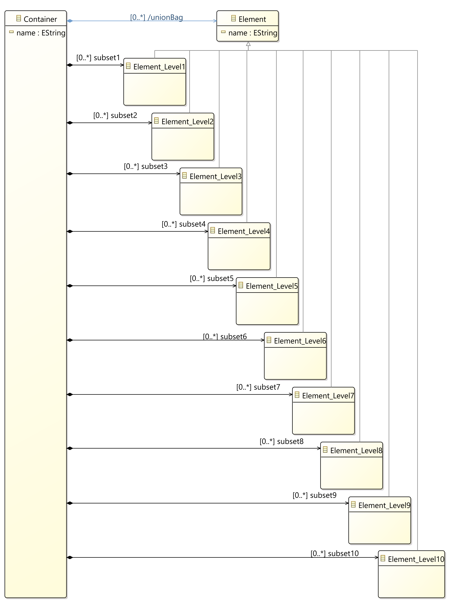

# Example model "SubsetUnion"

The functionality of the subset union implementation of MDE4CPP will be demonstrated in this example. The main implementation is located in the annotation `prepareApplication` using the key `sourceCodeMain`. The algorithm creates an object for each `Element_Level` class and puts it only into the appropriate subset. The content of all subsets and the union will be printed out.


To generate the c++ project as well as gradle build files, execute:
```
Windows:
  gradlew generateModel -PModel=%MDE4CPP_HOME%/src/examples/commonExamples/SubsetUnionExample/SubsetUnion/model/subsetUnion.ecore

Unix:
  gradlew generateModel -PModel=$MDE4CPP_HOME/src/examples/commonExamples/SubsetUnionExample/SubsetUnion/model/subsetUnion.ecore
```
in MDE4CPP home folder or call script file:
```
Windows:
  generate

Unix:
  ./generate
```
in model folder.

Following tasks are available after first code generation (build.gradle files are generated):
 * To compile the generated c++ project (executable and library), use:
```
gradlew compileApplicationForSubsetUnion
```
 * To compile the generated c++ library (without executable), use:
```
gradlew compileSubsetUnion
```
 * To generate the model again, use:
```
gradlew generateSubsetUnion
```
 * To generate and compile with single command, use:
```
gradlew buildSubsetUnion
```

Resulting executables and libraries will be delivered to folder `%MDE4CPP_HOME%/application/bin` and can be executed there.

## Model figures



## Execution result:
```
Printing out subset of level 1
Container name:
Name: Element1
-------------------
Printing out subset of level 2
Container name:
Name: Element2
-------------------

...

-------------------
Printing out subset of level 10
Container name:
Name: Element10
-------------------
Printing out the Union. Size: 11
Name: Element0
Name: Element1
Name: Element2
Name: Element3
Name: Element4
Name: Element5
Name: Element6
Name: Element7
Name: Element8
Name: Element9
Name: Element10
-------------------
```
